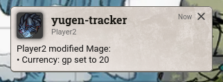
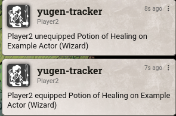
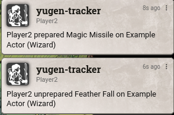
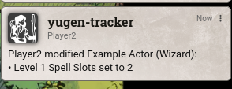

# yugen-tracker
_A Foundry VTT sheet tracking module with Discord Integration for maintaining campaign integrity._

---

With real-time tracking and ingame alerts, you can see if players are making modifications to their sheet during games or while the session isn't active.

 This provides a reliable audit log for GMs against players you may suspect are tampering with their sheets without you knowing (adding/removing/changing spell slots, etc.).

## Settings

| Setting | Description | Default |
| :--- | :--- | :--- |
| **Hide Gamemaster Changes** | If enabled, changes made by Gamemasters will not be tracked or announced. | `true` |
| **Track All Owned Sheets** | If enabled, all sheets owned by a player will be tracked (preventing cheating on unassigned sheets). If disabled, only assigned characters are tracked. | `true` |
| **Track Concentration** | If enabled, starting or breaking concentration will be announced in chat. | `true` |
| **Display Biography Changes** | If enabled, changes to the character biography and personality traits will be announced. | `false` |
| **Sensitive Keys** | A comma-separated list of keys to ignore when "Display Biography Changes" is disabled. | `details.biography, ...` |
| **Output to File** | If enabled, logs will be saved to a .txt file in your Foundry data folder (Data/yugen-tracker-logs/). | `false` |
| **Log File Name** | The name of the log file (e.g., combat-log.txt). | `yugen-tracker-logs.txt` |
| **Discord Webhook** | Enter a Discord Webhook URL to send logs to a Discord channel. Leave empty to disable. | `""` |
| **Announce to Gamemasters** | If enabled, changes will be whispered to Gamemasters. | `true` |
| **Announce to Assistant Gamemasters** | If enabled, changes will be whispered to Assistant Gamemasters. | `true` |
| **Announce to Trusted Players** | If enabled, changes will be whispered to Trusted Players. | `true` |
| **Announce to All Players** | If enabled, changes will be sent as public chat messages to everyone (overrides other role settings). | `true` |

## Compatibility
- D&D 5e (2014 & 2024)
- Pathfinder 2e
- Warhammer Fantasy Roleplay 4th Edition
- Call of Cthulhu 7th Edition
- Foundry V14