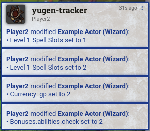
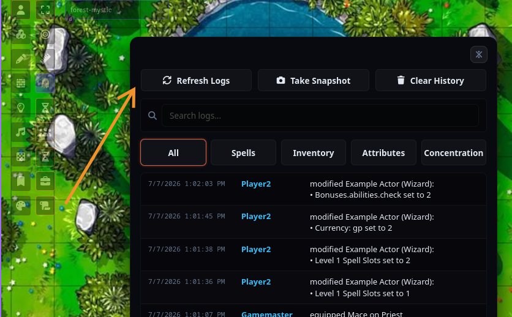
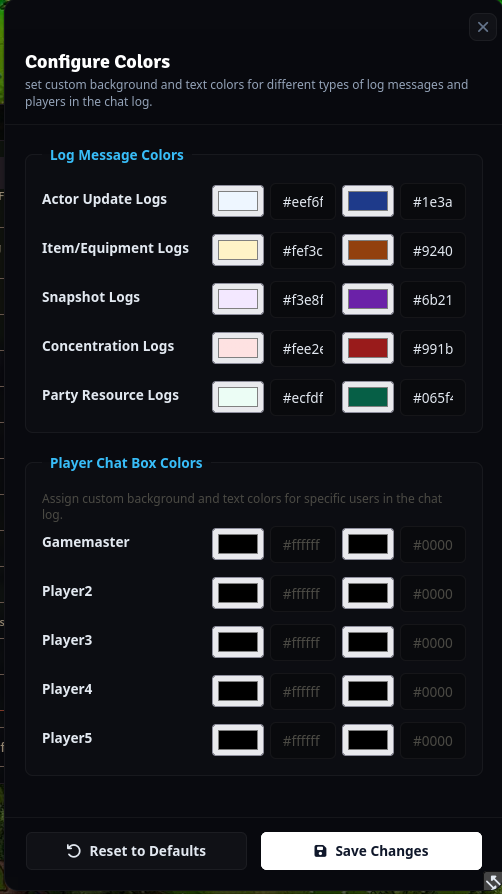

# yugen-tracker
<p align="center">
  <a href="https://www.youtube.com/watch?v=HaS7BjKM3xY">
    
  </a>
  <br>
  <a href="https://www.youtube.com/watch?v=HaS7BjKM3xY">Click here for video demonstration</a>
</p>

_A Foundry VTT sheet tracking module with Discord Integration for maintaining campaign integrity._

---

With real-time tracking and ingame alerts, you can see if players are making modifications to their sheet during games or while the session isn't active.

 This provides a reliable audit log for GMs against players you may suspect are tampering with their sheets without you knowing (adding/removing/changing spell slots, etc.).



## Settings

| Setting | Description | Default |
| :--- | :--- | :--- |
| **Hide Gamemaster Changes** | If enabled, changes made by Gamemasters will not be tracked or announced. | `true` |
| **Track All Owned Sheets** | If enabled, all sheets owned by a player will be tracked (preventing cheating on unassigned sheets). If disabled, only assigned characters are tracked. | `true` |
| **Track Concentration** | If enabled, starting or breaking concentration will be announced in chat. | `true` |
| **Display Biography Changes** | If enabled, changes to the character biography and personality traits will be announced. | `false` |
| **Sensitive Keys** | A comma-separated list of keys to ignore when "Display Biography Changes" is disabled. | `details.biography, ...` |
| **Output to File** | If enabled, logs will be saved to a .txt file in your Foundry data folder (Data/yugen-tracker-logs/). | `false` |
| **Log File Name** | The name of the log file (e.g., combat-log.txt). | `yugen-tracker-logs.txt` |
| **Allow Player Log Viewer** | If enabled, players will be able to open the log history viewer. | `false` |
| **Show Sidebar Button** | If enabled, the Log History button will appear in the Journal Notes sidebar and Directory header. | `true` |
| **Debug Mode** | If enabled, detailed technical logs will be printed to the browser console. | `false` |
| **Discord Webhook** | Enter a Discord Webhook URL to send logs to a Discord channel. Leave empty to disable. | `""` |
| **Announce to Gamemasters** | If enabled, changes will be whispered to Gamemasters. | `true` |
| **Announce to Assistant Gamemasters** | If enabled, changes will be whispered to Assistant Gamemasters. | `true` |
| **Announce to Trusted Players** | If enabled, changes will be whispered to Trusted Players. | `true` |
| **Announce to All Players** | If enabled, changes will be sent as public chat messages to everyone (overrides other role settings). | `true` |

## UI



You can access the Log History UI by clicking the **Log History** icon (a scroll) in the following locations:
- **Journal Notes**: In the left-hand Scene Controls sidebar, under the Journal Notes group.
- **Journal Directory**: In the header of the Journal sidebar tab.

### Player and Log Message Color Configuration



You can customize the presentation of both sheet tracking logs and individual player messages in the chat log. GMs can access this configuration screen from the Module Settings menu to customize background and text colors. This allows tracking messages and different players to stand out clearly in the chat stream.

### Accessing via Macro
If you have disabled the sidebar buttons or are using an older version of Foundry VTT where the buttons do not appear, you can open the UI using a macro:

```javascript
const module = game.modules.get( 'yugen-tracker' );
if ( !module?.active ) 
{
	ui.notifications.error( 'yugen-tracker is not active.' );
}
else 
{
	const { LogViewer } = await import( '/modules/yugen-tracker/scripts/module.js' );
	
	const viewer = LogViewer.instance;
	viewer.render( { force: true } );
	
	void viewer._request_logs( );
}
```

## Compatibility
- D&D 5e (2014 & 2024)
- Pathfinder 2e
- Warhammer Fantasy Roleplay 4th Edition
- Call of Cthulhu 7th Edition
- Foundry V13 and V14.